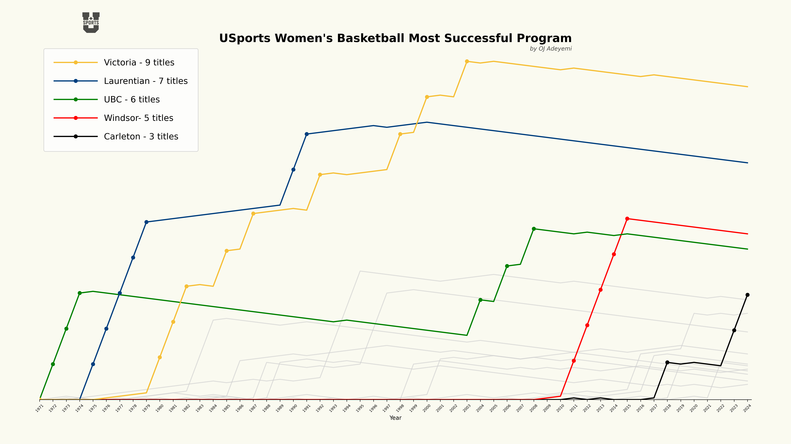
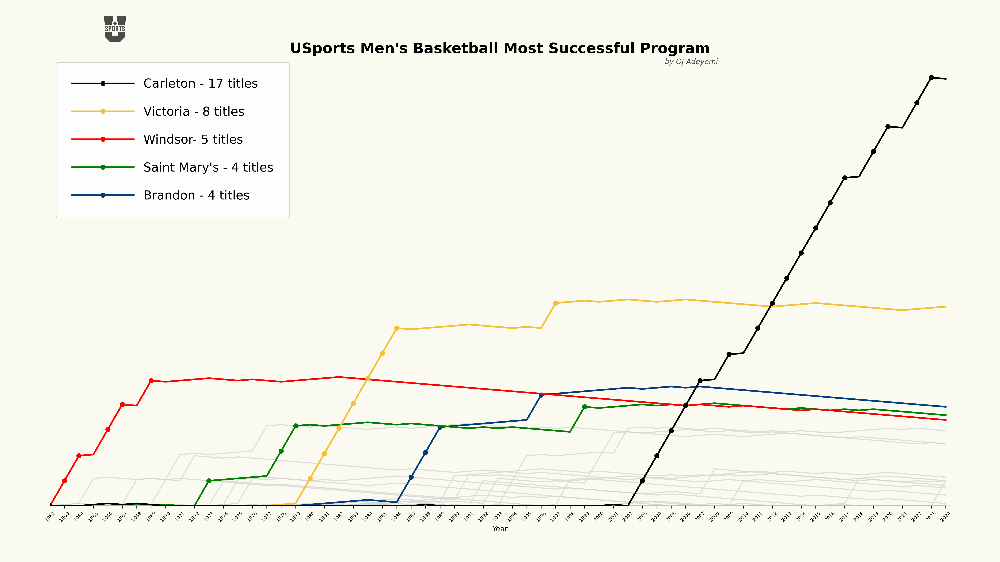

## Overview

- **Web Scraping:** Extract data from USports official website and USports hoops website using Python libraries like BeautifulSoup and requests.
- **Data Cleaning:** Process scraped data for consistency, accuracy, and relevance. Handle missing values, standardize formats, and remove duplicates.
- **Database Integration:** Store cleaned data into an SQLite database for efficient management and retrieval.
- **Data Analysis:** Analyze collected data for insights into team performance, player statistics, game outcomes, and other relevant metrics.
- **Data Visualization:** Utilize Matplotlib to create graphs and plots for visualizing analysis results.

## Graphs

Here are some visualizations generated from the analysis:

